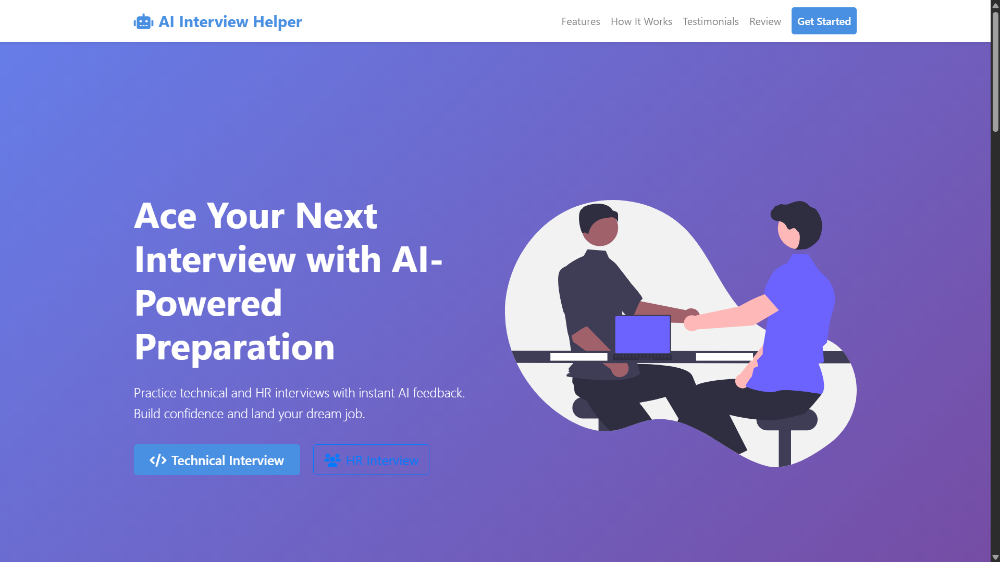

<div align="center">

# 🤖 AI Interview Helper

[](https://python.org)
[](https://djangoproject.com)
[](LICENSE)
[](https://ai-interview-helper.onrender.com/)

**🚀 [Live Demo](https://ai-interview-helper.onrender.com/) | 🐛 [Report Bug](https://github.com/Vicky16032205/ai-interview-helper/issues)**

*AI-powered interview preparation platform with intelligent feedback and comprehensive practice modules.*



</div>

## 📋 About the Project

Transform your interview preparation with AI Interview Helper – an intelligent, comprehensive platform that takes the guesswork out of job interview success. Powered by cutting-edge Google Gemini AI and built on the robust Django framework, this innovative web application serves as your personal interview coach, providing real-time feedback and personalized guidance across all interview formats.

From mastering behavioral questions using the proven STAR method to conquering complex coding challenges and data structure problems, our platform adapts to your unique learning style and skill level. Experience realistic interview simulations with voice recording capabilities, receive instant AI-powered analysis of your responses, and track your progress through detailed analytics that highlight your strengths while identifying areas for growth.

With an extensive library of curated questions and coding problems, intelligent adaptive learning algorithms, and comprehensive performance insights, AI Interview Helper empowers job seekers to build genuine confidence and develop the skills needed to excel in today's competitive job market. Whether you're a fresh graduate or an experienced professional, let our AI-driven platform guide you toward interview success.

## ✨ Features

- **🎤 HR Interview Practice** - 200+ behavioral questions with STAR method guidance
- **💻 Technical Coding** - Real-time coding challenges with AI evaluation
- **🧮 DSA Problems** - 500+ curated data structure and algorithm problems
- **🧠 AI Feedback** - Powered by Google Gemini AI for intelligent analysis
- **📊 Progress Tracking** - Detailed analytics and performance insights
- **🎵 Voice Recording** - Practice with audio responses and transcription

## 🚀 Quick Start

### Prerequisites
- Python 3.8+
- Git
- [Google Gemini API key](https://aistudio.google.com/)

### Installation

```bash
# Clone the repository
git clone https://github.com/Vicky16032205/ai-interview-helper.git
cd ai-interview-helper

# Create virtual environment
python -m venv venv
venv\Scripts\activate  # Windows
# source venv/bin/activate  # macOS/Linux

# Install dependencies
pip install -r requirements.txt

# Configure environment
copy .env.example .env  # Windows
# cp .env.example .env  # macOS/Linux
```

Edit `.env` file:
```env
SECRET_KEY=your-secret-key
GEMINI_API_KEY=your-gemini-api-key
DEBUG=True
```

```bash
# Setup database
python manage_dev.py migrate
python manage_dev.py load_sample_questions  # Optional

# Run the application
python manage_dev.py runserver
```

Visit `http://localhost:8000` to start practicing!

## 🛠 Tech Stack

- **Backend**: Django 5.0.1, Python 3.8+
- **AI**: Google Gemini AI, AssemblyAI
- **Frontend**: Bootstrap, JavaScript, Web Audio API
- **Database**: SQLite (dev), PostgreSQL (prod)
- **Deployment**: Docker, Render, Gunicorn

## 📁 Project Structure

```
ai_interview_helper/
├── ai_interview_helper/   # Django project settings
│   ├── settings.py        # Configuration
│   ├── urls.py           # URL routing
│   ├── wsgi.py           # WSGI config
│   └── asgi.py           # ASGI config
├── apps/                 # Django applications
│   ├── core/             # Homepage and navigation
│   ├── dsa/              # DSA practice module
│   └── interview/        # Interview practice module
├── static/               # Static files (CSS, JS, images)
├── templates/            # HTML templates
├── media/                # User uploads (audio, resumes)
├── staticfiles/          # Collected static files
├── docs/                 # Documentation and images
├── manage.py             # Django management script
├── manage_dev.py         # Development management script
├── requirements.txt      # Python dependencies
├── render.yaml           # Render deployment config
├── build.sh              # Build script
└── README.md             # This file
```

## 🤝 Contributing

1. Fork the repository
2. Create feature branch (`git checkout -b feature-name`)
3. Commit changes (`git commit -m 'Add feature'`)
4. Push to branch (`git push origin feature-name`)
5. Open Pull Request

## 📄 License

MIT License - see [LICENSE](LICENSE) file for details.

## 📞 Support

- **Issues**: [GitHub Issues](https://github.com/Vicky16032205/ai-interview-helper/issues)
- **Discussions**: [GitHub Discussions](https://github.com/Vicky16032205/ai-interview-helper/discussions)

---

<div align="center">

**Ready to ace your next interview? 🚀**

[](https://github.com/Vicky16032205/ai-interview-helper/stargazers)

*Made with ❤️ by [Vicky16032205](https://github.com/Vicky16032205)*

</div>
